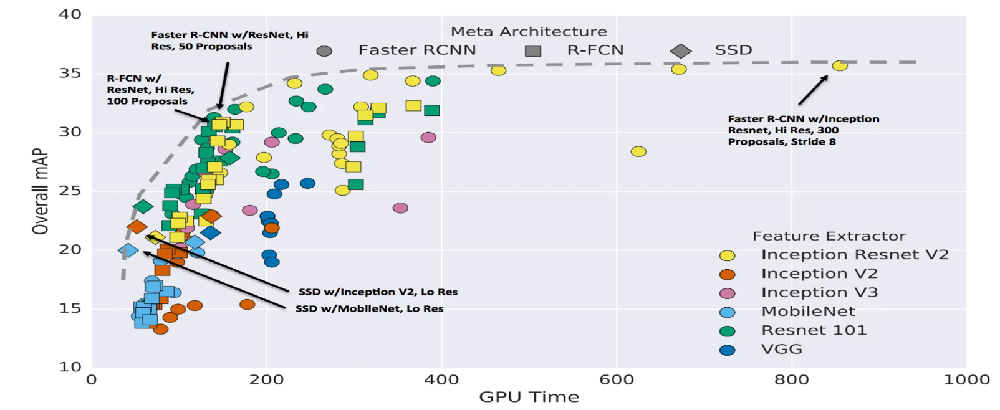
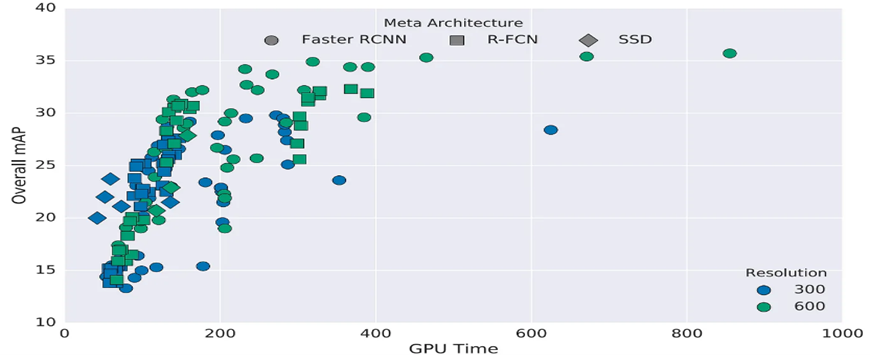
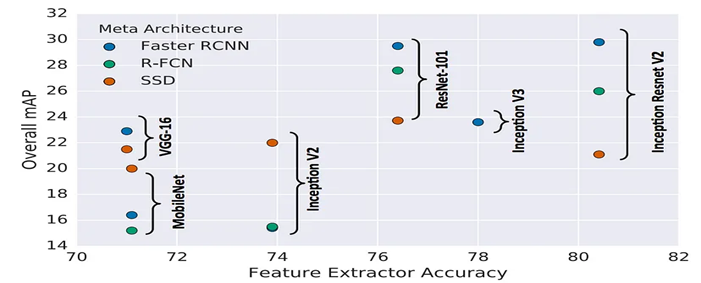
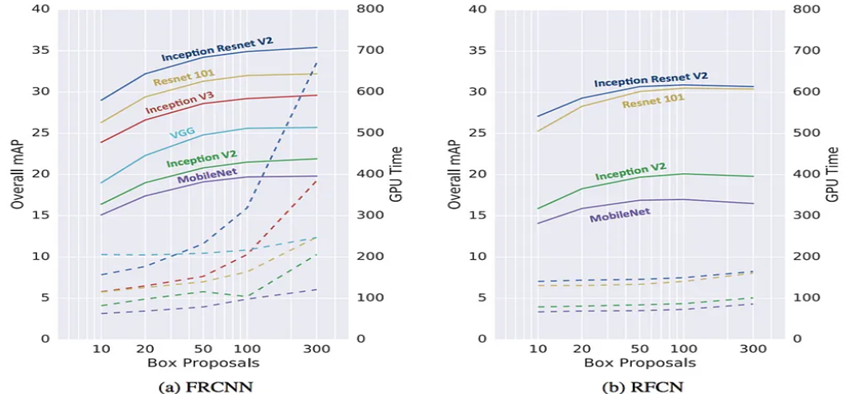

# RecoMatrix


AI Enigma Contest task on real time complex object detection using computer vision and machine learning in python

## Algorithms planned to be implemented

<details>
<summary>Click to expand</summary>

- [x] Faster R-CNN
- [x] R-FCN
- [x] SSD

</details>
<br>

## Project Structure

### COCOFasterR-CNN

```bash
complexObjectDetection
|--- output
|--- scripts
|--- src
|  |--- coco.names
|  |--- detector.py
|  |--- main.py
|--- test
|--- env.yml

```

### Directory Details

- **output**: This directory is for keeping the detected new images. Used by the `createBoundingBox` method in `detector.py` file
- **trained_model**: After testing against Faster and Mask R-CNN, finally,Faster R-CNN which is generated by the downloader from TF Object Detection Model Zoo
- **scripts**: A directory created & defined by the developers to keep useful scripts for making the developement of this project as seamless as possible
- **src**: Holds the `python` codes
- **test**: It is used to store the existing and real time complex `image` and `videos` which are used by the `main.py` file for training the model.

## Environment Setup

The project environment is managed by [ conda ](https://docs.conda.io/projects/miniconda/en/latest/). Details are given below:

- OS Platform: `Linux 6.5.5-arch1-1`
- Python Version: `Python 3.9.0`
- PIP Version: `pip 23.2.1`
- Conda Version: `conda 23.7.4`
- Tensorflow Version: `tensorflow-gpu 2.6.0`
- Cuda Toolkit Version: `cudatoolkit 11.2.2`
- CUDNN Version: `8.1`

The above mentioned python packages version matching is an important part. It must be noticed that if the libraries versions are matching or not. There are two ways to make the developement environment ready:

### Automatic - Using the YML file

I have created an `env.yml` file using conda so that it becomes easier to install the developement libraries in one command. Use this command to install all the required libraries with specific versions.

> Note that `conda` must be installed first

```bash
conda env create -f env.yml
```

### Manual

Every packages can be installed manually. The advantage of installing manually is that we get more control and it gets easier to solve errors and also find errors.

- Create the virtual environment first

```bash
conda env create --name tf_gpu python 3.9
conda activate tf_gpu
```

- Install the libraries

```bash
conda install cudatoolkit=11.2 cudnn=8.1 -c=conda-forge
pip install tensorflow-gpu==2.6
pip install opencv-python
```

## Running the project

We have made running the project much easier

- Activate the conda virtual environment first

```bash
conda activate tf_gpu
```

- Go to the `src` directory

```bash
cd src
```

- Run the `main` file

```bash
python main.py
```

### Command Line Arguments

We have added some _CLA_ to out project so that we don't need to change in code when we want to run in different modes of our project. For example, currently we have a `--camera` argument which will activate the live detection using the webcam

```bash
python main.py --camera
```

Currently supported CLA are:

```bash
--help      Print the built in help menu for this program
--camera    Enable the live detection using camera
```

## Performance Analysis

### Meta Architecture (Accuracy and Speed)



### Meta Architecture (Object Resolution)



### Meta Architecture (Feature Extractor)



### Architecture (Proposals Count)




## References

- [COCO Dataset](https://cocodataset.org/#home)
- [TF Object Detection Model Zoo](https://github.com/tensorflow/models/blob/master/research/object_detection/g3doc/tf2_detection_zoo.md)

# Authors

<a href="https://github.com/karit7"></a> <a href="https://github.com/abir-tx"></a>
